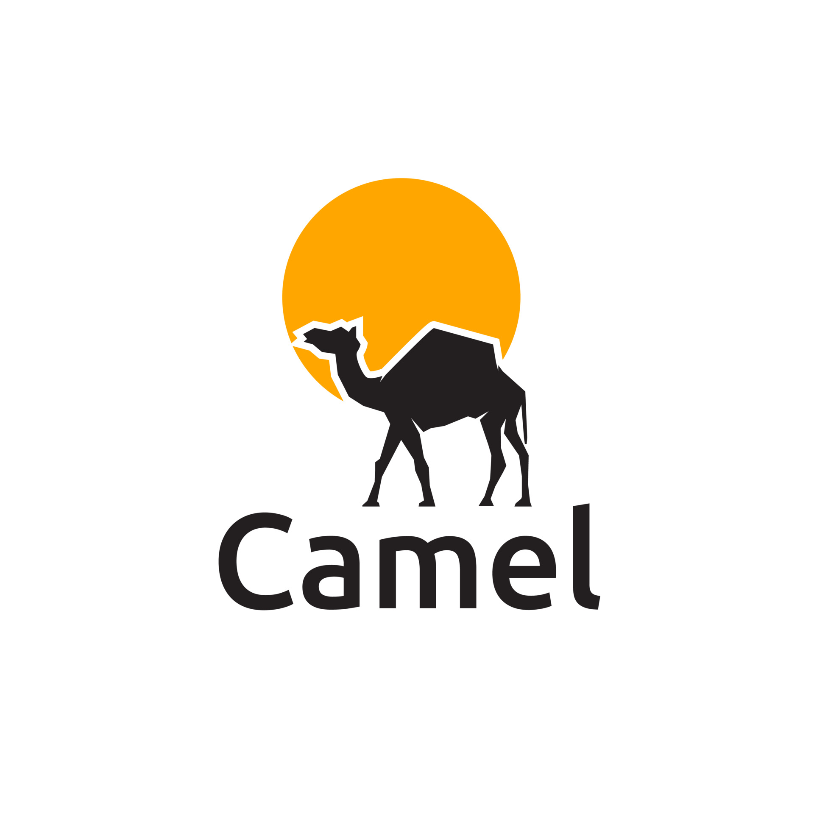

   
   
Camel is a Monkey-based, C-like programming language. 
It was written purely for fun. 
It is currently an interpreted language. Our next step is writing a compiler for Camel, making it faster.  
The ultimate goal is to have a self-hosted programming language. 
<a href="https://www.vecteezy.com/free-vector/camel-logo">Camel Logo Vectors by Vecteezy</a>

